# 前端开发


## 新建数据模型
1）	切换到iUAP开发视图，工程上右键选择新建下的新建数据模型

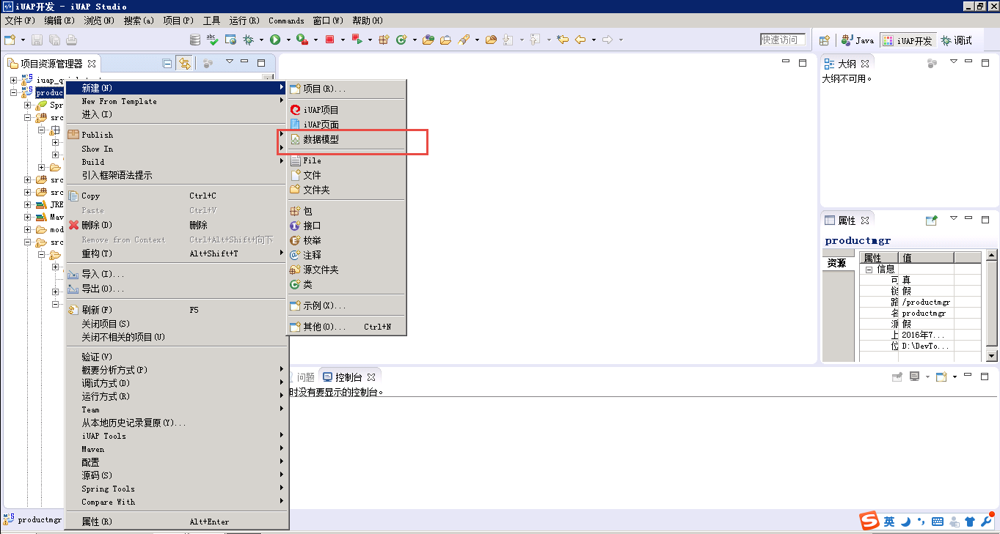

2）	输入文件名为product.model，点击下一步

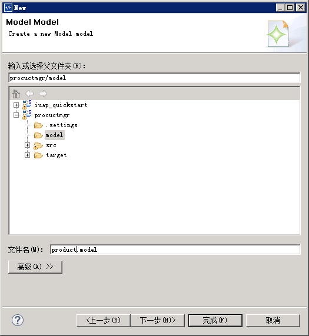

3）选择实体类为Product，点击下一步

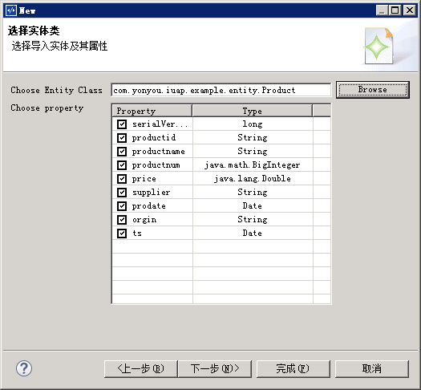

4）使用默认的UTF-8编码，点击完成

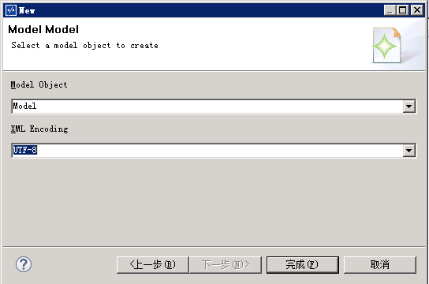

5）	工具生成数据模型文件，如下图

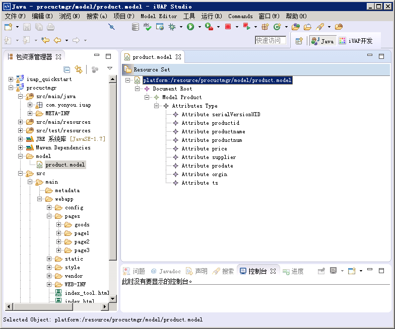

## 新建iuap页面

1）	在webapp的pages下右键新建iuap页面，点击下一步

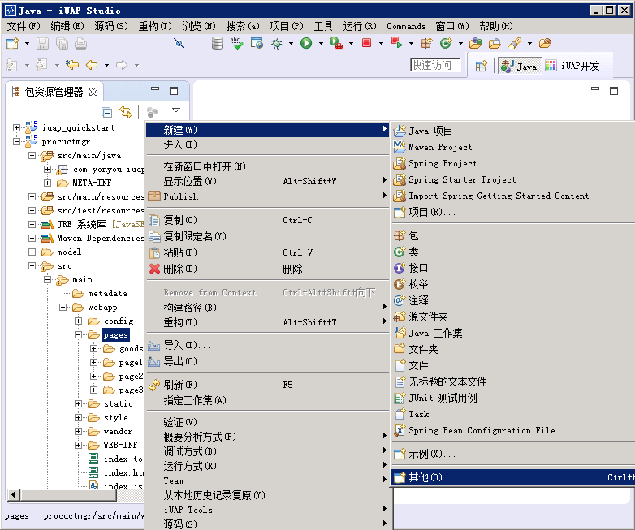
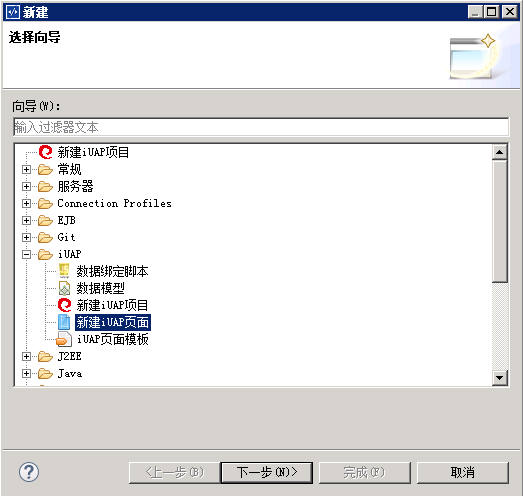
 
也可以切换到iUAP开发视图，在webapp下的pages目录右键，选择新建下的iUAP页面

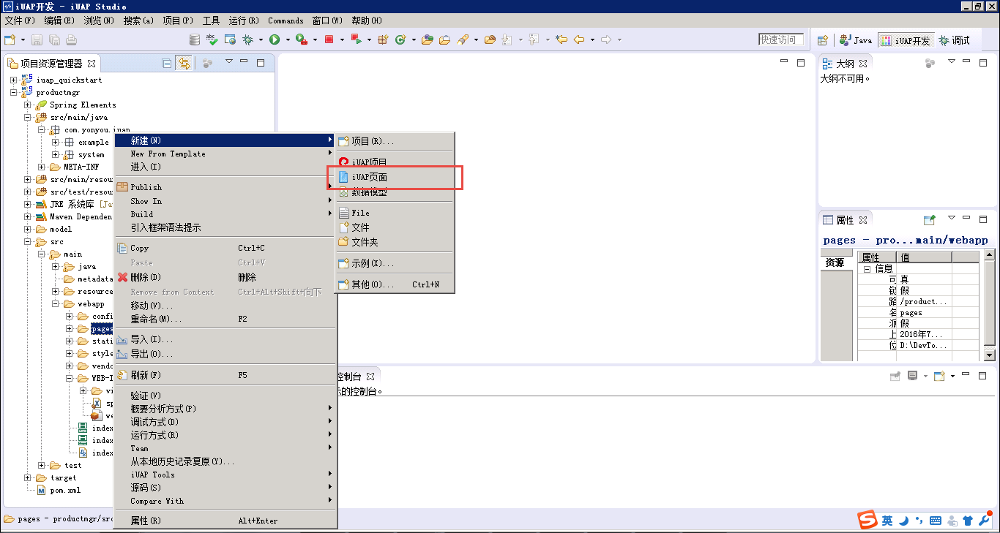

2）	输入页面目录名称为product，勾选使用数据模型，点击下一步

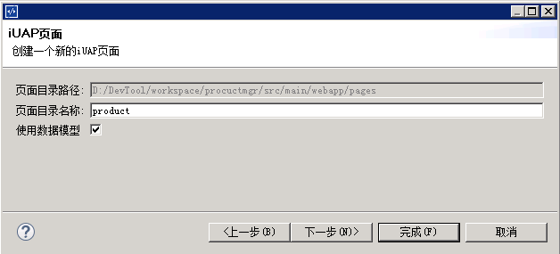

3）选择数据模型为Product，勾选右下角的选择，点击完成

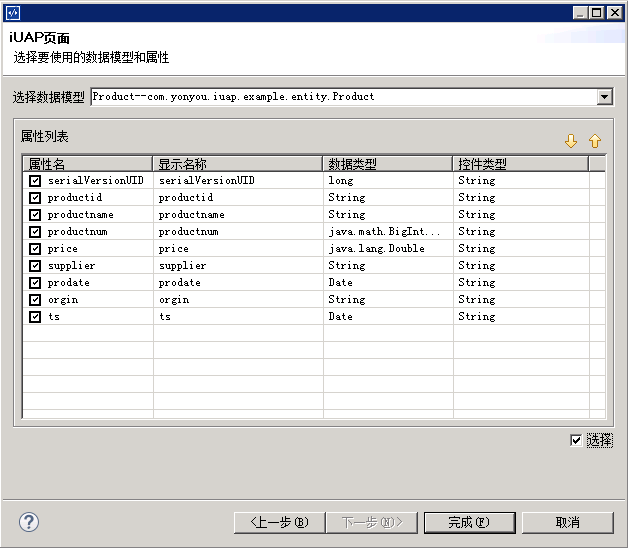

4）工具为用户生成功能模块的js文件和html片段，所在位置如下图

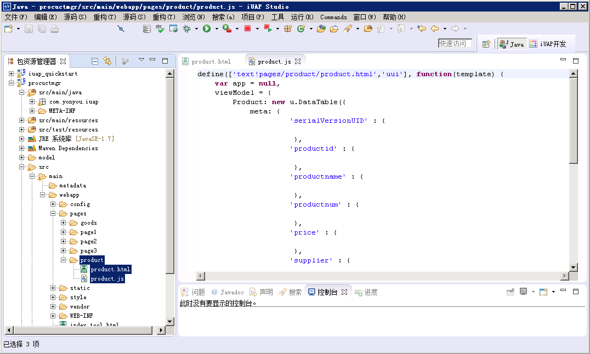

## 调整模块的js文件

1）	定义js前端的datatable数据模型，修完成改后如下

```
mainDataTable: new u.DataTable({
	meta: {
		'productid':{
			type:'string'
		},
		'productname': {
			type: 'string'
		},
		'productnum': {
			type: 'integer'
		},
		'price': {
			type: 'float'
		},
		'supplier': {
			type: 'string'
		}, //供应商
		'prodate': {
			type: 'date'
		}, //生成日期
		'orgin': {
			type: 'string'
		} //原产地
	},
	pageSize: 10
})
```

2）	定义事件方法，如查询、添加、返回等，例如删除方法：

```
delRow: function() {
	var selectArray = viewModel.mainDataTable.selectedIndices();
	if (selectArray.length < 1) {
		u.messageDialog({
			msg: "请选择要删除的行!",
			title: "提示",
			btnText: "OK"
		});
		return;
	}
	u.confirmDialog({
	    msg: "是否确认删除？",
	    title: "测试确认",
	    onOk: function () {
		$.ajax({
			url:ctrlBathPath+'/del',
			type:'post',
			data:{data:JSON.stringify(viewModel.mainDataTable.getSimpleData({type:'select',fields:['productid']}))},
			success: function(){
				u.showMessage('删除成功！');
				viewModel.events.queryMain();
			}
		});
	    },
	    onCancel: function () {
		
	    }
	});
}
```

3）	对应html片段，绑定事件，完整示例product.js代码如下：

```
define(['jquery', 'knockout', 'text!pages/product/product.html', 'uui'], function($, ko, template) {

	var ctrlBathPath = ctx+'/product';
	var app, viewModel, datas;
	var viewModel = {
		md: document.querySelector('#demo-mdlayout'),
		editoradd: '',
		searchText: ko.observable(''),
		mainDataTable: new u.DataTable({
			meta: {
				'productid':{
					type:'string'
				},
				'productname': {
					type: 'string'
				},
				'productnum': {
					type: 'integer'
				},
				'price': {
					type: 'float'
				},
				'supplier': {
					type: 'string'
				}, //供应商
				'prodate': {
					type: 'date'
				}, //生成日期
				'orgin': {
					type: 'string'
				} //原产地
			},
			pageSize: 10
		}),
		infodata: new u.DataTable({
			meta: {
				'productid':{
					type:'string'
				},
				'productname': {
					type: 'string'
				},
				'productnum': {
					type: 'integer',
					precision: 0,
					min: 0
				},
				'price': {
					type: 'float',
					precision: 2,
					min: 0
				},
				'supplier': {
					//供应商
					type: 'string'
				},
				'prodate': {
					//生成日期
					type: 'date'
				}, 
				'orgin': {
					//原产地
					type: 'string'
				} 
			}
		}),
		
		events: {
			//查询主数据
			queryMain: function(){
				var queryData = {};
				var searchValue = viewModel.searchText();
				var key = 'search_LIKE_productname';
				queryData[key] = searchValue;
		        
		        queryData["pageIndex"] = viewModel.mainDataTable.pageIndex();
		        queryData["pageSize"] = viewModel.mainDataTable.pageSize();
				$.ajax({
					type : 'GET',
					url : ctrlBathPath+'/page',
					data : queryData,
					dataType : 'json',
					success : function(result) {
						var data = result.data;
						if(data!=null){
							viewModel.mainDataTable.setSimpleData(data.content);
							viewModel.mainDataTable.totalPages(data.totalPages);
						} else {
							
						}
					}
				});
			},
			//搜索
			search: function(){
				this.events.queryMain();
			},
			searchKeyUp: function(model,event){
				if (event.keyCode == '13'){
					if(u.isIE){
						event.target.blur();
						this.events.queryMain();
						event.target.focus();
					} else {
						this.events.queryMain();
					}
				}
				return true;
			},
			afterAdd:function(element, index, data){
	            if (element.nodeType === 1) {
	                u.compMgr.updateComp(element);
	            }
	        },
			goBack: function() {
				viewModel.md['u.MDLayout'].dBack();
			},
			goPage: function(pathStr) {
				viewModel.md['u.MDLayout'].dGo(pathStr);
			},
			beforeAdd: function() {
				viewModel.editoradd = 'add';
				viewModel.infodata.clear();
				viewModel.infodata.createEmptyRow();
				viewModel.infodata.setRowSelect(0);
				viewModel.md['u.MDLayout'].dGo('addPage');
			},
			addOrEditRow: function() {
				var self = this;
				var _meta = this.mainDataTable.meta;
				var addInfo = this.infodata.getAllRows();
				var url = '';
				var postData = {};
				if (this.editoradd === 'add') {
					url = ctrlBathPath+'/save';
					postData = JSON.stringify(this.infodata.getSimpleData()[0]);
				} else {
					url = ctrlBathPath+'/update';
					postData = JSON.stringify(self.infodata.getSimpleData({type:'select'})[0]);
				}
				$.ajax({
					url:url,
					type:'POST',
					contentType: 'application/json',
					data:postData,
					success:function(res){
						if (res.flag == 'success'){
							if (self.editoradd === 'add'){
								self.mainDataTable.addSimpleData(res.data);
							}else{
								var curRow = viewModel.mainDataTable.getCurrentRow();
								curRow.setSimpleData(viewModel.infodata.getCurrentRow().getSimpleData(), 'upd');

							}
							viewModel.md['u.MDLayout'].dBack();
							u.showMessage('保存成功！');								
						}else{
							u.showMessageDialog(res.msg);
						}
					},
					error:function(){
						//待显示错误信息
					}
				});
				
			},
			
			beforeEdit: function(id) {
				viewModel.mainDataTable.setRowSelect(id);
				viewModel.infodata.setSimpleData(viewModel.mainDataTable.getSimpleData({
					type: 'select'
				}));
				viewModel.editoradd = 'edit';
				viewModel.md['u.MDLayout'].dGo('addPage');
			},
			
			delRow: function() {
				var selectArray = viewModel.mainDataTable.selectedIndices();
				if (selectArray.length < 1) {
					u.messageDialog({
						msg: "请选择要删除的行!",
						title: "提示",
						btnText: "OK"
					});
					return;
				}
		        u.confirmDialog({
		            msg: "是否确认删除？",
		            title: "测试确认",
		            onOk: function () {
		                $.ajax({
		                	url:ctrlBathPath+'/del',
		                	type:'post',
		                	data:{data:JSON.stringify(viewModel.mainDataTable.getSimpleData({type:'select',fields:['productid']}))},
		                	success: function(){
		                		u.showMessage('删除成功！');
		                		viewModel.events.queryMain();
		                	}
		                });
		            },
		            onCancel: function () {
		                
		            }
		        });
			},
			viewRow: function(id) {
				//如果样式列表不含有checkbox说明不是第一列
				if (event.target.classList.toString().indexOf('checkbox') < 0) { 
					viewModel.mainDataTable.setRowFocus(id);
					viewModel.md['u.MDLayout'].dGo('showPage');
				}
			},
			pageChangeFunc: function(index){
				viewModel.mainDataTable.pageIndex(index);
				viewModel.events.queryMain();		
			},
			sizeChangeFunc: function(size){
				viewModel.mainDataTable.pageSize(size);
				viewModel.events.queryMain();
			}
		}
	};

	var init = function(params) {
		var app = u.createApp({
			el: '#content',
			model: viewModel
		});
		viewModel.md = document.querySelector('#demo-mdlayout');
	    viewModel.events.queryMain();
	};

	return {
		'model': viewModel,
		'template': template,
		'init': init
	};
});
```

## 调整模块的html片段

1）	调整html片段，调整表格和表单的html片段，示例如下：
```
<div class="u-widget-body">
	<table class="u-table" style="width:100%;">
		<thead>
			<tr>
				<th><label class="u-checkbox only-style" data-bind="click: mainDataTable.toggleAllSelect.bind(mainDataTable), css:{'is-checked': mainDataTable.allSelected()}">
					<input id="checkInput" type="checkbox" class="u-checkbox-input">
					<span class="u-checkbox-label"></span> </label></th>
				<th>名称</th>
				<th>数量</th>
				<th>单价</th>
				<th>供应商</th>
				<th>生成日期</th>
				<th>原产地</th>
				<th>操作</th>
			</tr>
		</thead>
		<tbody data-bind="foreach:{data:mainDataTable.rows(),as:'row', afterAdd: events.afterAdd}" >
			<tr data-bind="css: { 'is-selected' : row.selected() } ,attr:{'id': $index()}">
				<td class="checkbox1"><label class="u-checkbox only-style u-checkbox-floatl" data-bind="click: row.multiSelect, css:{'is-checked': row.selected()}">
					<input type="checkbox" class="u-checkbox-input">
					<span class="u-checkbox-label"></span> </label></td>
				<td data-bind="text: row.ref('productname')"></td>
				<td data-bind="text: row.ref('productnum')"></td>
				<td data-bind="text: row.ref('price')"></td>
				<td data-bind="text: row.ref('supplier')"></td>
				<td data-bind="text: u.dateRender(row.ref('prodate'))"></td>
				<td data-bind="text: row.ref('orgin')"></td>
				<td><a href="javascript:;" class="m-r-sm" data-bind="click:$parent.events.beforeEdit.bind($data,  $index())">修改</a><a href="javascript:;" data-bind="click:$parent.events.viewRow.bind($data, $index())">查看</a></td>
			</tr>
		</tbody>
	</table>
	<div id='pagination' class='u-pagination pagination' u-meta='{"type":"pagination","data":"mainDataTable","pageChange":"events.pageChangeFunc","sizeChange":"events.sizeChangeFunc"}'></div>

</div>
```

2）	使用ko语法绑定事件和数据模型

```
<tr data-bind="css: { 'is-selected' : row.selected() } ,attr:{'id': $index()}">
	<td class="checkbox1"><label class="u-checkbox only-style u-checkbox-floatl" data-bind="click: row.multiSelect, css:{'is-checked': row.selected()}">
		<input type="checkbox" class="u-checkbox-input">
		<span class="u-checkbox-label"></span> </label>
	</td>
	<td data-bind="text: row.ref('productname')"></td>
	<td data-bind="text: row.ref('productnum')"></td>
	<td data-bind="text: row.ref('price')"></td>
	<td data-bind="text: row.ref('supplier')"></td>
	<td data-bind="text: u.dateRender(row.ref('prodate'))"></td>
	<td data-bind="text: row.ref('orgin')"></td>
	<td><a href="javascript:;" class="m-r-sm" data-bind="click:$parent.events.beforeEdit.bind($data,  $index())">修改</a><a href="javascript:;" data-bind="click:$parent.events.viewRow.bind($data, $index())">查看</a></td>
</tr>

```

3）	完整的示例代码如下：

```
<!-- 页面内容区(HTML片段，不能放置HTML 及 BODY 标签 )-->
<div class="u-mdlayout" id="demo-mdlayout">

	<div class="u-mdlayout-master" style="display:none"></div>

	<div class="u-mdlayout-detail">
		<div class="u-mdlayout-page u-navlayout-fixed-header current" id="list">
			<div class="u-mdlayout-page-section">
				
					<div class="u-container-fluid u-widget-bg">
						<div class="u-row">
							<div class="u-col-12">
								<div class="u-widget" style="background-color:transparent">
									<button class="u-button raised primary m-r-sm" data-bind="click: events.beforeAdd">
										新增
									</button>
									<button class="u-button raised" data-bind="click: events.delRow">
										删除
									</button>
									<div class="u-input-group u-has-feedback u-right m-r-sm">
										<!-- 如果多条件查询，定义多个输入框或者修改后端查询方式  -->
										<input type="text" class="u-form-control sm" placeholder="商品名称" data-bind="value:searchText,event:{keyup: events.searchKeyUp}"/>
										<span class="u-form-control-feedback sm fa fa-search" data-bind="click:events.search"></span>
									</div>
								</div>
							</div>
						</div>
						<div class="u-row">
							<div class="u-col-12">
								<div class="u-widget">

									<div class="u-widget-heading">
										<h3 class="u-widget-title">产品列表</h3>
									</div>
									<div class="u-widget-body">
										<table class="u-table" style="width:100%;">
											<thead>
												<tr>
													<th><label class="u-checkbox only-style" data-bind="click: mainDataTable.toggleAllSelect.bind(mainDataTable), css:{'is-checked': mainDataTable.allSelected()}">
														<input id="checkInput" type="checkbox" class="u-checkbox-input">
														<span class="u-checkbox-label"></span> </label></th>
													<th>名称</th>
													<th>数量</th>
													<th>单价</th>
													<th>供应商</th>
													<th>生成日期</th>
													<th>原产地</th>
													<th>操作</th>
												</tr>
											</thead>
											<tbody data-bind="foreach:{data:mainDataTable.rows(),as:'row', afterAdd: events.afterAdd}" >
												<tr data-bind="css: { 'is-selected' : row.selected() } ,attr:{'id': $index()}">
													<td class="checkbox1"><label class="u-checkbox only-style u-checkbox-floatl" data-bind="click: row.multiSelect, css:{'is-checked': row.selected()}">
														<input type="checkbox" class="u-checkbox-input">
														<span class="u-checkbox-label"></span> </label></td>
													<td data-bind="text: row.ref('productname')"></td>
													<td data-bind="text: row.ref('productnum')"></td>
													<td data-bind="text: row.ref('price')"></td>
													<td data-bind="text: row.ref('supplier')"></td>
													<td data-bind="text: u.dateRender(row.ref('prodate'))"></td>
													<td data-bind="text: row.ref('orgin')"></td>
													<td><a href="javascript:;" class="m-r-sm" data-bind="click:$parent.events.beforeEdit.bind($data,  $index())">修改</a><a href="javascript:;" data-bind="click:$parent.events.viewRow.bind($data, $index())">查看</a></td>
												</tr>
											</tbody>
										</table>
										<div id='pagination' class='u-pagination pagination' u-meta='{"type":"pagination","data":"mainDataTable","pageChange":"events.pageChangeFunc","sizeChange":"events.sizeChangeFunc"}'></div>

									</div>

								</div>
							</div>
						</div>

					</div>

				
			</div>
		</div>
		<!--编辑/新增-->
		<div class="u-mdlayout-page u-navlayout-fixed-header" id="addPage">
			<div class="u-mdlayout-page-section">
				<div class="u-container-fluid u-widget-bg">
					<div class="u-row">
						<div class="u-col-12">
							<div class="u-widget" style="background-color:transparent">
								<button class="u-button raised m-r-sm" data-bind="click: events.goBack">
									返回
								</button>
								<button class="u-button raised primary" data-bind='click:events.addOrEditRow'>
									保存
								</button>
							</div>
						</div>
					</div>
					<div class="u-row">
						<div class="u-col-12">
							<div class="u-widget">
								<div class="u-widget-heading">
									<h3 class="u-widget-title">商品信息</h3>
								</div>
								<div class="u-widget-body form-container">
									<div class="u-container-fluid">
										<div class="u-row">
											<div class="u-col-1 u-col-sm-4">
												<label class="u-input-label right">商品名称:</label>
											</div>
											<div class="u-col-3 u-col-sm-8 m-b-md">
												<input type="text" class="u-form-control" placeholder="商品名称" u-meta='{"id":"productname","type":"string","data":"infodata","field":"productname"}'>
											</div>
											<div class="u-col-1 u-col-sm-4">
												<label class="u-input-label right">单价:</label>
											</div>
											<div class="u-col-3 u-col-sm-8 m-b-md">
												<input type="text" class="u-form-control" placeholder="单价" u-meta='{"id":"price","type":"float","data":"infodata","field":"price"}'>
											</div>
											<div class="u-col-1 u-col-sm-4">
												<label class="u-input-label right">供应商:</label>
											</div>
											<div class="u-col-3 u-col-sm-8 m-b-md">
												<input type="text" class="u-form-control" placeholder="供应商" u-meta='{"id":"supplier","type":"string","data":"infodata","field":"supplier"}'>
											</div>
										</div>
										<div class="u-row">
											<div class="u-col-1 u-col-sm-4">
												<label class="u-input-label right">数量:</label>
											</div>
											<div class="u-col-3 u-col-sm-8 m-b-md">
												<input type="text" class="u-form-control" placeholder="数量" u-meta='{"id":"productnum","type":"integer","data":"infodata","field":"productnum"}'>
											</div>
											<div class="u-col-1 u-col-sm-4">
												<label class="u-input-label right">生成日期:</label>
											</div>
											<div class="u-col-3 u-col-sm-8 m-b-md">
												<div class="u-input-group u-has-feedback" u-meta='{"id":"prodate","type":"u-date","data":"infodata","field":"prodate"}'>
													<input type="text" class="u-form-control"/>
													<span class="u-form-control-feedback fa fa-calendar" data-role="date-button"></span>
												</div>
											</div>
											<div class="u-col-1 u-col-sm-4">
												<label class="u-input-label right">原产地:</label>
											</div>
											<div class="u-col-3 u-col-sm-8 m-b-md">
												<input type="text" class="u-form-control" placeholder="原产地" u-meta='{"id":"orgin","type":"string","data":"infodata","field":"orgin"}'>
											</div>
										</div>
									</div>
								</div>
							</div>

						</div>
					</div>
				</div>
			</div>
		</div>

		<div class="u-mdlayout-page u-navlayout-fixed-header" id="showPage">
			<div class="u-mdlayout-page-section">
				<div class="u-container-fluid u-widget-bg">
					<div class="u-row">
						<div class="u-col-12">
							<div class="u-widget" style="background-color:transparent">
								<button class="u-button raised primary m-r-sm" data-bind="click: events.goBack">
									返回
								</button>
							</div>
						</div>
					</div>
					<div class="u-row">
						<div class="u-col-12">
							<div class="u-widget">
								<div class="u-widget-heading">
									<h3 class="u-widget-title">商品信息</h3>
								</div>
								<div class="u-widget-body form-container">
									<ul class="u-form-browse">
										<li class="m-v">
											<label class="u-control-label w-sm">商品名称:</label>
											<span data-bind="text:mainDataTable.ref('productname')"></span>
										</li>
										<li class="m-v">
											<label class="u-control-label w-sm">单价:</label>
											<span data-bind="text: mainDataTable.ref('price')"></span>
										</li>
										<li class="m-v">
											<label class="u-control-label w-sm">供应商:</label>
											<span data-bind="text:mainDataTable.ref('supplier')"></span>
										</li>
										<li class="m-v">
											<label class="u-control-label w-sm">数量:</label>
											<span data-bind="text: mainDataTable.ref('productnum')"></span>
										</li>
										<li class="m-v">
											<label class="u-control-label w-sm">生产日期:</label>
											<span data-bind="text:u.dateRender(mainDataTable.ref('prodate'))"></span>
										</li>
										<li class="m-v">
											<label class="u-control-label w-sm">原产地:</label>
											<span data-bind="text:mainDataTable.ref('orgin')"></span>
										</li>
									</ul>
								</div>
							</div>

						</div>
					</div>
				</div>

			</div>
		</div>
	</div>
</div>
```

4）请注意，js的数据模型中的字段定义务必和html中的数据绑定处的字段名称一致


