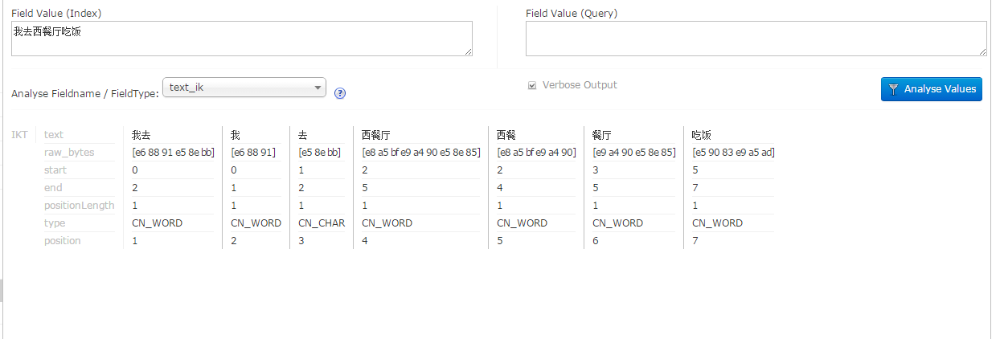

# 搜索组件 #

## 业务需求 ##

在互联网应用中，全文检索功能必不可少，随着用户的输入可以输出联想词汇，并根据用户最终输入搜索出所有相关的内容，对于提高用户体验和减轻数据库查询压力有着重要的作用。

## 解决方案 ##
iuap的搜索组件选择Solr作为全文检索的中间件来提供搜索服务功能，实现对站内数据或者表单数据的全文检索。Solr的封装及扩展性较好，通过集群方式可以实现索引容量的动态扩展和主从节点的故障自动切换。本组件对Solrj做了轻量封装，解耦了索引的修改和检索操作，索引检索执行同步操作，索引修改执行异步操作，避免索引修改使用同步所造成的响应时间延长。

##功能说明##
1.	屏蔽Solrj的语法复杂性，提供流式API；
2.	支持索引的增加、删除操作；
3.	对索引的更新操作提供异步接口，可以自由对接各种中间件；
4.	增加中文分词API；
5.	支持应用自定义词库。

# 使用说明 #

## Maven配置 ##

搜索组件内部依赖solrj的5.5.0和org.apache.lucene组下的相关4.10.4组件，项目上依赖iuap-search组件即可。

针对组件的依赖如下：

	<dependency>
	  <groupId>com.yonyou.iuap</groupId>
	  <artifactId>iuap-search</artifactId>
	  <version>${iuap.modules.version}</version>
	</dependency>

${iuap.modules.version} 为平台在maven私服上发布的组件的version。

## 示例准备 ##
1. 在solr example下collection1中的schema.xml添加以下内容

		<field name="tenentid" type="string" indexed="true" stored="false" multiValued="false"/>

2. 新建一个maven工程，导入maven依赖，实现如下代码

		public class Wood extends BaseSolrEntity implements Serializable {
		
		    @Field
		    private String id;
		
		    @Field
		    private String name;
		
		    @Field
		    private List<String> title;
		
		    @Field
		    private double count;
		
		    @Field
		    private Double money;
		
		    @Field("createtime")
		    private Date createTime;
		    
		    //此处省略getter,setter
		}

单元测试示例代码如下：

		public class SearchExample{
		    
		    @Test
		    public void testHttp() throws SearchException {
		        SearchClient searchClient = new SearchClient();
		        HttpSearchClient client = searchClient.createHttpSearchClient("http://192.168.56.101:8983/solr/collection1");
		        Criteria<Wood> criteria = client.createCriteria(Wood.class);
		        Page<Wood> result =
		                criteria.addQuery(SolrRestrictions.like("name", "awesome"))
		                        .addQuery(
		                                SolrRestrictions.or(SolrRestrictions.eq("name", "awesome"),
		                                        SolrRestrictions.like("title", "panda")))
		                        .addPageParam(
		                                new PageRequest(0, 1, new Sort(new Sort.Order(Sort.Direction.ASC, "id"),
		                                        new Sort.Order(Sort.Direction.DESC, "name"))))
		                        .page();
		        System.out.println(result.getContent());
		    }
		}

## 索引查询 ##
### 普通检索 ###

**solr 的query界面参数和Criteria API对应表**

<table style="border-collapse:collapse">
	<thead>
		<tr>
			<th>solr界面检索条件</th>
			<th>Criteria API</th>
		</tr>
	</thead>
	<tbody>
		<tr>
			<td>q</td>
			<td><code>addQuery()</code></td>
		</tr>
		<tr>
			<td>fq</td>
			<td><code>addFilterQuery()</code></td>
		</tr>
		<tr>
			<td>sort</td>
			<td><code>addPageParam()</code></td>
		</tr>
		<tr>
			<td>start,rows</td>
			<td><code>addPageParam()</code></td>
		</tr>
		<tr>
			<td>fl</td>
			<td><code>addReturnField()</code></td>
		</tr>
		<tr>
			<td>Raw Query Parameters</td>
			<td><code>addCustomParam()</code></td>
		</tr>
	</tbody>
</table>

### facet检索 ###
facet检索参数，对应Criteria API `addFacetParam()`,具体参数请参考`FacetParam.java`的API。

### Highlight ###
Highlight根据页面功能展示分为两类，一类是文档全文检索，展示结果为标题+内容，页面展示需要有内容的高亮片段。另一类是表单类检索，展示结果为标题，高亮的是标题。
- 展示结果是标题+内容的检索需求
  使用solr自带的highlight功能，对应Criteria API `addHighlightParam()`,具体参数请参考`HighlightParam.java`的API。
- 展示结果为标题的检索需求
  使用普通查询检索出分页结果之后，调用`WordAnalyzer.analysis(检索条件)`对检索条件进行中文分词，将分页结果和分词结果返回给前端，由前端负责高亮。

### Group ###
索引的分组查询，类似于数据库的group功能。对应Criteria API `addGroupParam()`,具体参数请参考`GroupParam.java`的API。

## 索引修改 ##
iuap search组件提供了索引修改的异步接口。解耦应用数据修改和索引数据修改的操作，降低系统响应时间，提高应用吞吐量。
典型配置如下：

- 索引创建的producer

    
    <!-- 索引数据生产者异步API，实现了com.yonyou.iuap.search.msg.MessageSender接口，负责生产索引 --> 
    <bean id="msgSender" class="com.yonyou.iuap.spring.netty.client.NettySender">
    </bean>

	    <!-- 应用调用接口，负责调用msgSender发送索引 -->
	    <bean id="msgClient" class="com.yonyou.iuap.spring.netty.client.MsgClient" init-method="init">
	        <property name="sender" ref="msgSender"/>
	    </bean>
	
	    <!-- 向搜索组件注册异步API -->
	    <bean id="searcClient" class="com.yonyou.iuap.search.processor.SearchClient">
	        <property name="messageSender" ref="msgSender"/>
	    </bean>

- 索引创建的consumer

	
	    <!-- 索引增加api的调用类 -->
	    <bean id="updateClient" class="com.yonyou.iuap.search.processor.UpdateClient">
	    </bean>
	
	     <!-- 索引消息解析类，解析消息之后，将数据在solr上建立索引 -->
	    <bean id="messageConsumer" class="com.yonyou.iuap.search.msg.MessageConsumer">
	        <property name="searchClient" ref="updateClient"/>
	    </bean>
	
	    <!-- 索引异步API消费者监听，负责接收生产者发送的索引数据，并调用消费者逻辑进行索引创建 -->
	    <bean id="msgServer" class="com.yonyou.iuap.spring.netty.server.MsgServer" init-method="init">
	        <property name="consumer" ref="messageConsumer"/>
	    </bean>

**更多API操作和配置方式，请参考对应的示例工程(DevTool/examples/example\_iuap_search)**

## 配置中文分词 ##

- 修改对应的core的config文件夹下的schema.xml,添加ik分词配置：

	    <!-- IKAnalyzer 中文分词--> 
	    <fieldType name="text_ik" class="solr.TextField">
			<analyzer type="index" isMaxWordLength="false" class="org.wltea.analyzer.lucene.IKAnalyzer"/>
			<analyzer type="query" isMaxWordLength="true" class="org.wltea.analyzer.lucene.IKAnalyzer"/>
		</fieldType>
		<field name="ik" type="text_ik" indexed="true" stored="true" multiValued="false" />  

- 在声明字段时，指定类型为text_ik

		<field name="title" type="text_ik" indexed="true" stored="true" multiValued="false"/>

- 将IKAnalyzer相关的jar包（IKAnalyzer2012FF_u1.jar）放在solr/WEB-INF/lib下
- 添加新的索引后，title字段的查询即支持中文分词，可以用solr控制台的分析工具查看分词效果
	
	

## 启用停用词功能和扩展词典 ##

- 将stopword.dic和IKAnalyzer.cfg.xml复制到classes根目录

		<?xml version="1.0" encoding="UTF-8"?>
		<!DOCTYPE properties SYSTEM "http://java.sun.com/dtd/properties.dtd">
		<properties>
			<comment>IK Analyzer 扩展配置</comment>
			<!--用户可以在这里配置自己的扩展字典 -->
			<entry key="ext_dict">ext.dic;</entry>
			<!--用户可以在这里配置自己的扩展停止词字典-->
			<entry key="ext_stopwords">stopword.dic;</entry>
		</properties>

	ext.dic 为自定义词语，stopword.dic为会屏蔽掉的词语。

- 扩展词典示例，修改ext.dic

	在ext.dic中添加"我去",分词效果如下图：

	

